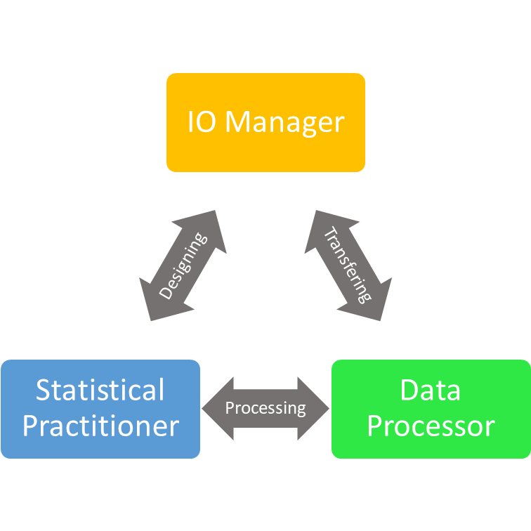
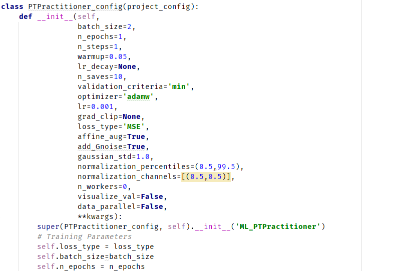
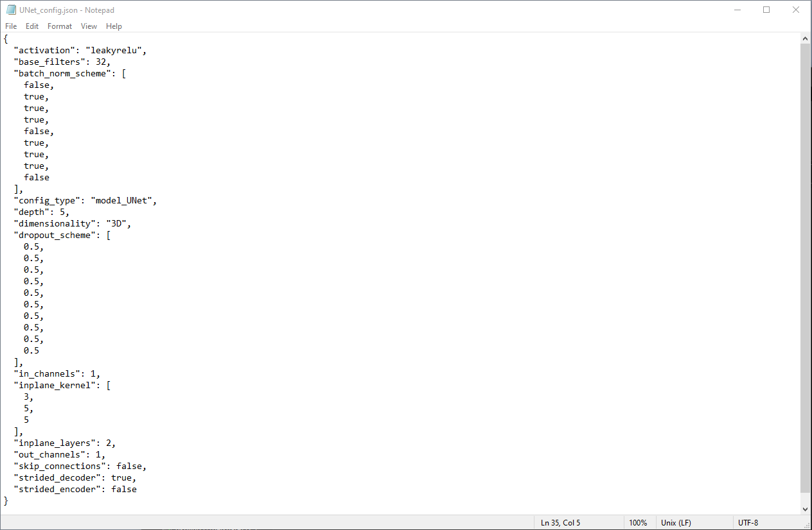

# project_team

## Installation

This project is originally programmed for Python 3.9 

The original package is hosted on test.pypi.org. To install the package, run the following command:

``` pip install -i https://test.pypi.org/simple/ project-team ``` 

Note: The pip installation does not install the requirements. To install the requirements, download the `requirements.txt` file and run the following command:

``` pip install -r requirements.txt ```

Alternatively you can install the package from the source code. To do so, follow the steps below:

1. Download this project and move current working directory to this project 
2. Run `python setup.py install`
3. Run `pip install -r requirements.py`
4. Use this package in other projects with the same environment

## Framework 

This is a package to organize, execute, and persist machine learning and applied statistical models. 

<p align="center"> 

The frame work is built of three main objects, an IO Manager, a Data Processor and a Statistical Practitioner:

- IO Manager: an object that manages all file flow in the framework, it decides where to load data from, where to save the data, and to build folders and frameworks for this loading and saving. 
- Data Processor: an object that will take an item run data type checks on it, process the data, and be able to reverse the processes to return back to the input that was given. 
- Statistical Practitioner: an object the can take data and run statistical analysis, training, or inference on that data. This object also keeps track of a model's parts, hyperparamters, and required resources to keep consistent applications. 

Between the three objects there are three key operations between two objects. 

- Transfering: includes loading data to be used by the processor and saving results that have been post processed.
- Processing: transforming input data to the proper space to be used by the practitioner, and transfering inference results from the statistical process. 
- Designing: developing and deploying a given statistical model that can have a persistent setup. The manager tells the PRactitioner where files are located and the Pracitioner checks requirements and loads data. 

### Table of Contents

**[Configurations](#configurations)**<br>
**[IO Managers](#io-managers)**<br>
**[Data Processors](#data-processors)**<br>
**[Statistical Practitioners](#statistical-practitioners)**<br>

## Configurations 

The currency of this framework is a configuration file. These objects take dictionaries of data that hold key aspects, or parameters to perform functions. Each object in the pro_team will have a config that it uses to understand principles necessary to do its job.

<em>An Example of a practitioner configuration that is specialized in using pytorch models. </em> 

<p align="left"> 

These config files save as txt dictionary files and can easily be manually edited in notepad. These items are light weight and can give objects flexibilty to change when a donfig is loaded. 

<em>An Example of a saved UNet model configuration. We can see a very well organized dictionary saved as a text file, where individual parameters could be edited manually and the alterations would be implemented when it is reloaded.  </em> 

<p align="left"> 

This object is largely inspired by the *transformers* package from huggingface. (https://huggingface.co/transformers)

## IO Managers

A manager has the job of handling all input and output functions with data and memory. A manager can take a csv file of all training data, and organize it for a specific statistical project. There are currentlly 3 programmed statistical projects: 
1. Train for deployment, or testing 
2. hyper parameter tuning 
3. k fold validation 

There are managers for specific packages typically, a pytorch specific manager (`Pytorch_Manager`). 

To come: sklearn manager (`SKLearn_Manager`)

## Data Processors

Data processor takes care of the data it is told to handle by the manager. It will apply the pretransforms that it is provided to a dataset. Each dataset has an option to `pre_load` into the process memory, or the processor can be set to preprocess data on the fly. It will ensure data for training and validation are treated similarly, and that inference data will not have an pretransforms to the model output. 

Current options: 
* `Images_Processor`: a processor specialized in handling PIL Image package processing 
* `Text_Processor`: a processor specialized in handling Text data wiht NLTK and huggingface packages 

To come: `SITK_Processor` that will handle medical image data with simpleITK package. 

## Statistical Practitioners

a Statistical Practitioner performs all machine learning algorithms, and statistical analysis on the data from the processor, then provides saveable models or test results to the manager to be saved. Currently there is only a few major practitioners: 
* `PT_Practitioner`: specialized in training and deploying pytorch models in a specific way. There are 2 current child objects for classification and regression. 
* `ClassificationEval_Practitioner`: this will run evaluation on two columns in a dataframe with designated performance metrics meant for classification tasks. 
* `ROCAnalysis_Practitioner`: this will calculate ROCAUC and print and ROC curve for two columns in a dataframe. 

To come: `PTSegmentation_Practitioner` that can handle the tasks of segmentatin, and `Transformers_Practitioner` that can handle tasks specific to the hugging face transformers package 

## Strange things to note 

These only use model states and does not ever save and load a whole model. If you model doesn't have 'items' attribute, then you saved in wrong. 

Resave it as a model state and then load it. 
