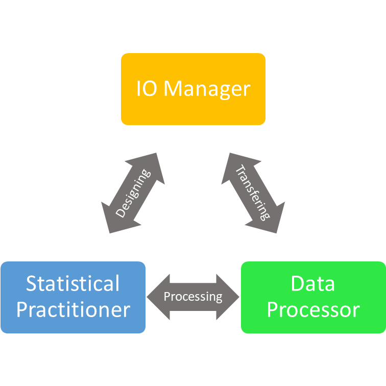
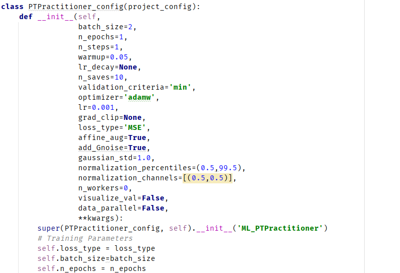
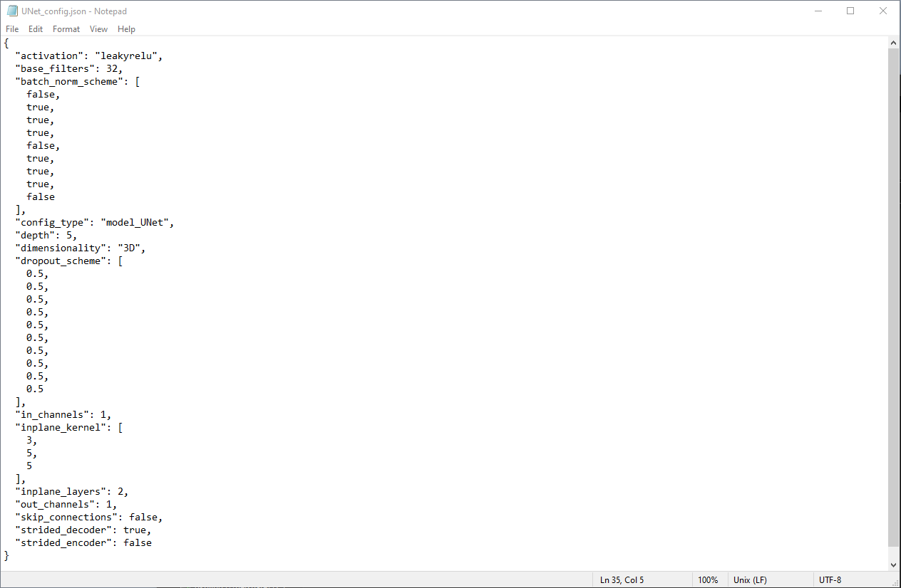

# project_team

[](https://github.com/gkuling/project_team/actions/workflows/ci.yml)

This is a package to organize, execute, and persist machine learning and
applied statistical models. It is a personal research and experimentation
harness, built first and foremost for learning and teaching — it favors
readable, traceable code over the feature breadth of production frameworks
like Lightning or Hydra.

## Requirements

- Python >= 3.10
- `transformers >= 4.30, < 5` — the configuration system subclasses
  huggingface's `PretrainedConfig`, and 5.x changed internals the config
  save/load path relies on. The pin is enforced by `setup.py`.

## Installation

To install the package, you can use the following command from in this
project folder (works with `pip` or `uv pip`):

```bash
pip install -e .
```

## Quickstart

Train, evaluate, and persist a CNN on MNIST with a train/validation/test
split:

```bash
python MNIST_classification_TrainTestSplit.py --working_dir ./project_team_runs
```

The run downloads MNIST into `working_dir/raw_mnist`, materializes it as
PNGs plus a `dataset_info.csv`, then trains and evaluates. Afterwards the
experiment folder holds every config as an editable JSON file, the dataset
splits as CSVs, checkpoints, and the final model weights. Re-run with
`--start_from_checkpoint` to resume training from the checkpoint. The other
three example scripts demonstrate k-fold validation, hyperparameter tuning,
and regression.

## Framework

<p align="center"> 

The framework is built of three main objects, an IO Manager, a Data Processor and a Statistical Practitioner:

- IO Manager: an object that manages all file flow in the framework, it decides where to load data from, where to save the data, and to build folders and frameworks for this loading and saving.
- Data Processor: an object that will take an item run data type checks on it, process the data, and be able to reverse the processes to return back to the input that was given.
- Statistical Practitioner: an object that can take data and run statistical analysis, training, or inference on that data. This object also keeps track of a model's parts, hyperparameters, and required resources to keep consistent applications.

Between the three objects there are three key operations between two objects.

- Transferring: includes loading data to be used by the processor and saving results that have been post processed.
- Processing: transforming input data to the proper space to be used by the practitioner, and transferring inference results from the statistical process.
- Designing: developing and deploying a given statistical model that can have a persistent setup. The manager tells the Practitioner where files are located and the Practitioner checks requirements and loads data.

### Table of Contents

**[Configurations](#configurations)**<br>
**[IO Managers](#io-managers)**<br>
**[Data Processors](#data-processors)**<br>
**[Statistical Practitioners](#statistical-practitioners)**<br>
**[Running the tests](#running-the-tests)**<br>
**[Design notes](#design-notes)**<br>

## Configurations

The currency of this framework is a configuration file. These objects take dictionaries of data that hold key aspects, or parameters to perform functions. Each object in the project_team will have a config that it uses to understand principles necessary to do its job.

<em>An Example of a practitioner configuration that is specialized in using pytorch models. </em>

<p align="left"> 

These config files save as json dictionary files and can easily be manually edited in notepad. These items are light weight and can give objects flexibility to change when a config is loaded.

<em>An Example of a saved UNet model configuration. We can see a very well organized dictionary saved as a text file, where individual parameters could be edited manually and the alterations would be implemented when it is reloaded.  </em>

<p align="left"> 

This object is largely inspired by the *transformers* package from huggingface. (https://huggingface.co/transformers)

## IO Managers

A manager has the job of handling all input and output functions with data and memory. A manager can take a csv file of all training data, and organize it for a specific statistical project. There are currently 3 programmed statistical projects:
1. Train for deployment, or testing
2. hyper parameter tuning
3. k fold validation

There are managers for specific packages typically, a pytorch specific manager (`Pytorch_Manager`).

Planned next steps live in [docs/ROADMAP.md](docs/ROADMAP.md) (for example an `SKLearn_Manager`).

## Data Processors

Data processor takes care of the data it is told to handle by the manager. It will apply the pretransforms that it is provided to a dataset. Each dataset has an option to `pre_load` into the process memory, or the processor can be set to preprocess data on the fly. It will ensure data for training and validation are treated similarly, and that inference data will not have any pretransforms to the model output.

Current options:
* `Image_Processor`: a processor specialized in handling PIL Image package processing
* `Text_Processor`: a processor specialized in handling text data with huggingface tokenizers

Planned next steps live in [docs/ROADMAP.md](docs/ROADMAP.md) (for example a `SITK_Processor` that will handle medical image data with the SimpleITK package).

## Statistical Practitioners

a Statistical Practitioner performs all machine learning algorithms, and statistical analysis on the data from the processor, then provides saveable models or test results to the manager to be saved. Currently there is only a few major practitioners:
* `PT_Practitioner`: specialized in training and deploying pytorch models in a specific way. There are 2 current child objects for classification and regression.
* `ClassificationEval_Practitioner`: this will run evaluation on two columns in a dataframe with designated performance metrics meant for classification tasks.
* `ROCAnalysis_Practitioner`: this will calculate ROCAUC and print and ROC curve for two columns in a dataframe.
* `Ordinal_Correlation_Practitioner`: this will run Kendall tau and Spearman correlation analysis between an ordinal and a continuous column.

## Running the tests

The test suite is CPU-only and needs no downloads:

```bash
uv venv .venv && uv pip install torch torchvision --index-url https://download.pytorch.org/whl/cpu && uv pip install -e ".[dev]"
```

```bash
pytest -m "not network"
```

## Design notes

- Models are persisted as `state_dict`s only — the framework never saves or
  loads a whole pickled model. If a loaded object does not have an
  `.items()` method, it was saved as a whole model rather than a state
  dictionary; re-save it as a state dictionary
  (`torch.save(model.state_dict(), ...)`) and load it again.
- Configuration files hold both hyperparameters and mutable run state
  (for example `trained_steps`); saving and reloading a config is how a
  run resumes mid-training.
